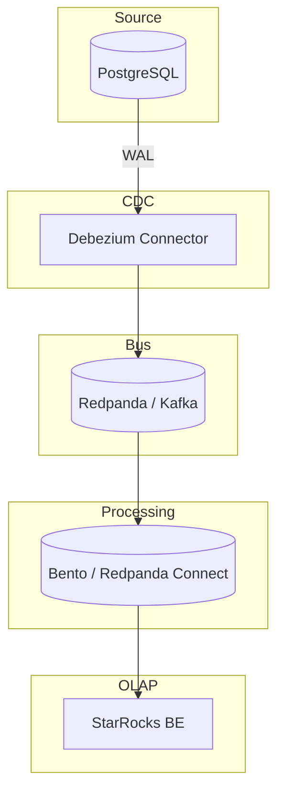

# Postgres-to-StarRocks Pipeline

>  **A lightweight, container‑first data pipeline that streams changes from PostgreSQL into StarRocks for real‑time analytics.**

  
## Table of Contents

1. [Overview](#overview)
2. [Architecture](#architecture)
3. [Tech Stack & Rationale](#tech-stack--rationale)
4. [Quick Start](#quick-start)


## Overview

This project provides an end‑to‑end **change‑data‑capture (CDC)** pipeline that:

1. Captures row‑level changes from **PostgreSQL** using **Debezium**.
2. Streams those changes through **Kafka** (or **Redpanda**) as an event bus.
3. Optionally enriches / filters messages with **Bento** (or **Redpanda connect**) processors.
4. Loads data into **StarRocks** for fast, columnar analytics.


## Architecture




## Tech Stack & Rationale
  
* **PostgresSQL**
No need to explain.

* **Debezium**
Battle‑tested open‑source CDC (Change Data Capture) engine; emits change events with minimal overhead.

* **Redpanda**
Event Bus compatible with Kafka, much easier to run on local computer.

* **Redpanda Console**
Kafka GUI that makes it easier to see what’s happening.

* **StarRocks**
If you’re here, it needs no introduction.

* **Goose**
Simple tool for running migrations on PostgreSQL and StarRocks.

* **hurl**
Straightforward way to apply Debezium migrations via HTTP.


## Quick Start

```bash

# 1. Clone the repo
git  clone  https://github.com/udleinati/postgres‑to‑starrocks‑pipeline.git
cd  postgres‑to‑starrocks‑pipeline

# 2. Create basic infra
docker compose -f docker-compose.infra.yml up -d
 
# 3. Create tables, basic data and debezium connector
docker compose -f docker-compose.migrations.yml up

# 4. Run Bento
docker compose -f docker-compose.connectors.yml up

```


### Modify PostgreSQL data

Connect to your local PostgreSQL instance (host 127.0.0.1, user root, database main, schema core, tables tenant and store).


### Monitor changes

Use the Redpanda Console to observe change events at http://localhost:8088/.


### View the changes in StarRocks

Connect to your StarRocks cluster via the MySQL protocol (host 127.0.0.1, user root, database main, tables core_tenant and core_store).